# CV AI Job Platform — ERD, Business Logic & Backend Implementation Report

> **Diagram Format**: All diagrams are written in **Mermaid** syntax. Paste into [mermaid.live](https://mermaid.live), draw.io (with Mermaid plugin), or any Mermaid renderer for visual output and customisation.

---

## Table of Contents

1. [Full System ERD](#1-full-system-erd)
2. [Authentication & Authorization System](#2-authentication--authorization-system)
3. [CV AI Analysis Pipeline](#3-cv-ai-analysis-pipeline)
4. [Job Posting & Application System](#4-job-posting--application-system)
5. [Meeting & Scheduling System](#5-meeting--scheduling-system)
6. [Direct Offers System](#6-direct-offers-system)
7. [Admin Business Intelligence & Analytics](#7-admin-business-intelligence--analytics)
8. [Notification Architecture](#8-notification-architecture)
9. [Resume Coach AI System](#9-resume-coach-ai-system)
10. [Bulk B2B Onboarding System](#10-bulk-b2b-onboarding-system)

---

## 1. Full System ERD

### 1.1 Complete Entity Relationship Diagram

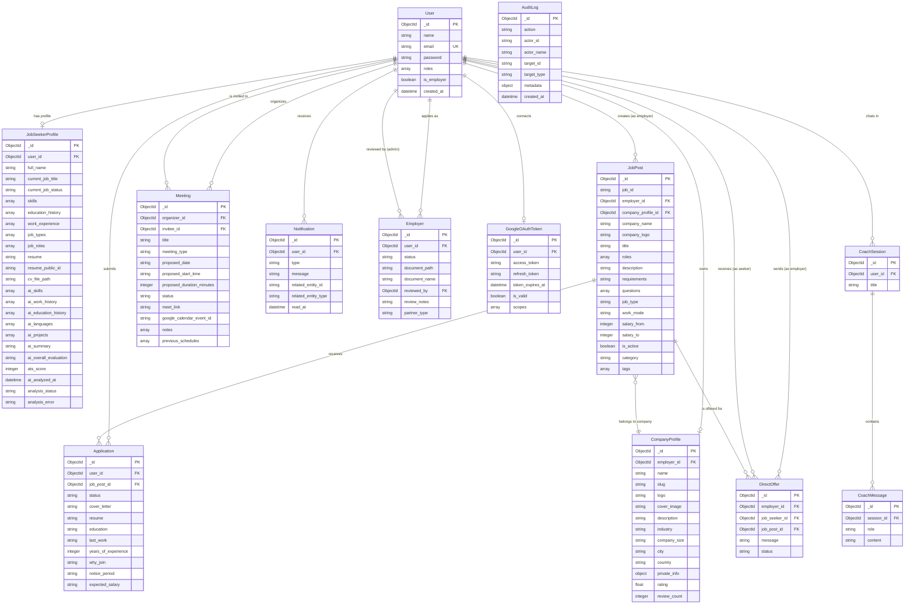
```mermaid
erDiagram
    User ||--o| JobSeekerProfile : "has profile"
    User ||--o{ Application : "submits"
    User ||--o{ JobPost : "creates (as employer)"
    User ||--o| CompanyProfile : "owns"
    User ||--o{ DirectOffer : "sends (as employer)"
    User ||--o{ DirectOffer : "receives (as seeker)"
    User ||--o{ Meeting : "organizes"
    User ||--o{ Meeting : "is invited to"
    User ||--o{ Notification : "receives"
    User ||--o{ Employer : "applies as"
    User ||--o| GoogleOAuthToken : "connects"
    User ||--o{ CoachSession : "chats in"

    JobPost ||--o{ Application : "receives"
    JobPost }o--|| CompanyProfile : "belongs to company"
    JobPost ||--o{ DirectOffer : "is offered for"

    CoachSession ||--o{ CoachMessage : "contains"

    Employer }o--|| User : "reviewed by (admin)"

    User {
        ObjectId _id PK
        string name
        string email UK
        string password
        array roles
        boolean is_employer
        datetime created_at
    }

    JobSeekerProfile {
        ObjectId _id PK
        ObjectId user_id FK
        string full_name
        string current_job_title
        string current_job_status
        array skills
        array education_history
        array work_experience
        array job_types
        array job_roles
        string resume
        string resume_public_id
        string cv_file_path
        array ai_skills
        array ai_work_history
        array ai_education_history
        array ai_languages
        array ai_projects
        string ai_summary
        string ai_overall_evaluation
        integer ats_score
        datetime ai_analyzed_at
        string analysis_status
        string analysis_error
    }

    JobPost {
        ObjectId _id PK
        string job_id
        ObjectId employer_id FK
        ObjectId company_profile_id FK
        string company_name
        string company_logo
        string title
        array roles
        string description
        string requirements
        array questions
        string job_type
        string work_mode
        integer salary_from
        integer salary_to
        boolean is_active
        string category
        array tags
    }

    CompanyProfile {
        ObjectId _id PK
        ObjectId employer_id FK
        string name
        string slug
        string logo
        string cover_image
        string description
        string industry
        string company_size
        string city
        string country
        object private_info
        float rating
        integer review_count
    }

    Application {
        ObjectId _id PK
        ObjectId user_id FK
        ObjectId job_post_id FK
        string status
        string cover_letter
        string resume
        string education
        string last_work
        integer years_of_experience
        string why_join
        string notice_period
        string expected_salary
    }

    DirectOffer {
        ObjectId _id PK
        ObjectId employer_id FK
        ObjectId job_seeker_id FK
        ObjectId job_post_id FK
        string message
        string status
    }

    Meeting {
        ObjectId _id PK
        ObjectId organizer_id FK
        ObjectId invitee_id FK
        string title
        string meeting_type
        string proposed_date
        string proposed_start_time
        integer proposed_duration_minutes
        string status
        string meet_link
        string google_calendar_event_id
        array notes
        array previous_schedules
    }

    Notification {
        ObjectId _id PK
        ObjectId user_id FK
        string type
        string message
        string related_entity_id
        string related_entity_type
        datetime read_at
    }

    Employer {
        ObjectId _id PK
        ObjectId user_id FK
        string status
        string document_path
        string document_name
        ObjectId reviewed_by FK
        string review_notes
        string partner_type
    }

    GoogleOAuthToken {
        ObjectId _id PK
        ObjectId user_id FK
        string access_token
        string refresh_token
        datetime token_expires_at
        boolean is_valid
        array scopes
    }

    CoachSession {
        ObjectId _id PK
        ObjectId user_id FK
        string title
    }

    CoachMessage {
        ObjectId _id PK
        ObjectId session_id FK
        string role
        string content
    }

    AuditLog {
        ObjectId _id PK
        string action
        string actor_id
        string actor_name
        string target_id
        string target_type
        object metadata
        datetime created_at
    }
```

### 1.2 Business Context

The data model is designed around a **three-sided marketplace**:

| Actor | Role | Core Value |
|-------|------|------------|
| Job Seeker | `employee` | Finds jobs, gets AI-powered CV feedback, receives direct offers |
| Employer | `employer` | Posts jobs, searches candidates, sends offers, schedules interviews |
| Admin | `admin` | Governs platform trust, monitors health, drives growth metrics |

Every entity traces back to the `User` model as the identity anchor. MongoDB's document model is leveraged to embed complex nested data (skills arrays, education history, private company info) within a single document rather than normalising into separate collections — this optimises for the read-heavy patterns of a job marketplace where profile and job listing pages must load fast.

---

## 2. Authentication & Authorization System

### 2.1 Partial ERD

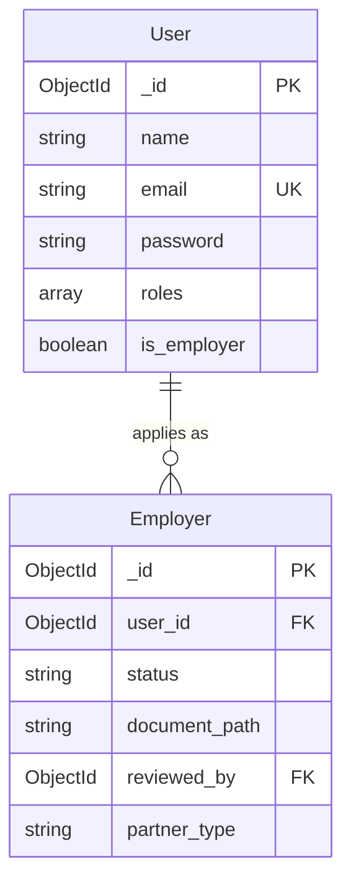
```mermaid
erDiagram
    User ||--o{ Employer : "applies as"
    User {
        ObjectId _id PK
        string name
        string email UK
        string password
        array roles
        boolean is_employer
    }
    Employer {
        ObjectId _id PK
        ObjectId user_id FK
        string status
        string document_path
        ObjectId reviewed_by FK
        string partner_type
    }
```

### 2.2 Authentication Flow

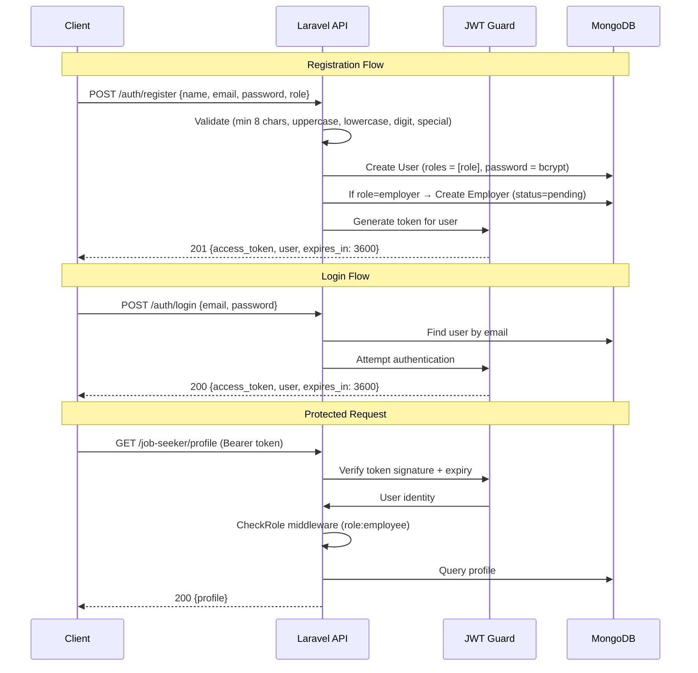
```mermaid
sequenceDiagram
    participant Client
    participant API as Laravel API
    participant JWT as JWT Guard
    participant DB as MongoDB

    Note over Client, DB: Registration Flow
    Client->>API: POST /auth/register {name, email, password, role}
    API->>API: Validate (min 8 chars, uppercase, lowercase, digit, special)
    API->>DB: Create User (roles = [role], password = bcrypt)
    API->>DB: If role=employer → Create Employer (status=pending)
    API->>JWT: Generate token for user
    JWT-->>Client: 201 {access_token, user, expires_in: 3600}

    Note over Client, DB: Login Flow
    Client->>API: POST /auth/login {email, password}
    API->>DB: Find user by email
    API->>JWT: Attempt authentication
    JWT-->>Client: 200 {access_token, user, expires_in: 3600}

    Note over Client, DB: Protected Request
    Client->>API: GET /job-seeker/profile (Bearer token)
    API->>JWT: Verify token signature + expiry
    JWT->>API: User identity
    API->>API: CheckRole middleware (role:employee)
    API->>DB: Query profile
    API-->>Client: 200 {profile}
```

### 2.3 Authorization Decision Tree

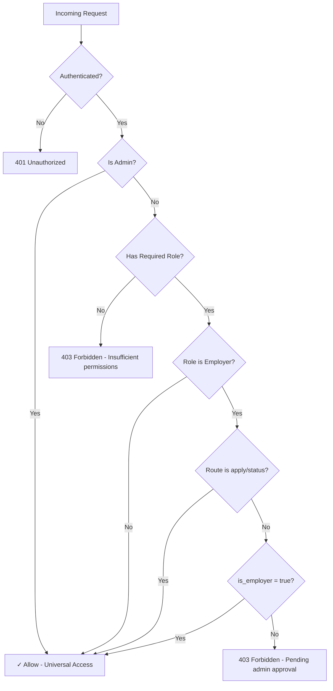
```mermaid
flowchart TD
    A[Incoming Request] --> B{Authenticated?}
    B -->|No| C[401 Unauthorized]
    B -->|Yes| D{Is Admin?}
    D -->|Yes| E[✓ Allow - Universal Access]
    D -->|No| F{Has Required Role?}
    F -->|No| G[403 Forbidden - Insufficient permissions]
    F -->|Yes| H{Role is Employer?}
    H -->|No| E
    H -->|Yes| I{Route is apply/status?}
    I -->|Yes| E
    I -->|No| J{is_employer = true?}
    J -->|Yes| E
    J -->|No| K[403 Forbidden - Pending admin approval]
```

### 2.4 Business Logic Deep-Dive

**The Employer Approval Gate — Why It Exists**

In a two-sided job marketplace, trust is the platform's most valuable asset. An unapproved employer posting fraudulent jobs or harvesting CV data would:
- Expose job seekers to scams (phishing, identity theft, fake interviews)
- Destroy platform reputation (one viral "scam job" post damages all employers' credibility)
- Create legal liability (platform becomes an accessory to fraud)

The approval gate creates a human verification layer:

1. **Registration** → user gets `roles: ['employer']` + an Employer record with `status: 'pending'`
2. **Document upload** → employer submits a business license, trade registry, or similar proof
3. **Admin review** → admin inspects the document, approves or rejects
4. **On approval** → `is_employer = true` is set, unlocking all employer routes

**Code implementation** (`CheckRole.php`):
```php
// Employers additionally require admin approval
if (in_array('employer', $roles) && $user->hasRole('employer') && !$user->isAdmin()) {
    $path = $request->path();
    $preApprovalRoutes = ['api/employer/apply', 'api/employer/status'];
    if (!in_array($path, $preApprovalRoutes) && !$user->is_employer) {
        return response()->json([
            'error'   => 'Forbidden',
            'message' => 'Your employer account is pending admin approval.',
        ], 403);
    }
}
```

The `preApprovalRoutes` exception is a critical UX detail: employers must access the `apply` and `status` endpoints *before* being approved (to submit their application and check its progress). Without this whitelist, they'd be locked in a paradox — needing approval to request approval.

**Why JWT over sessions?**
The platform serves a separate frontend (SPA or mobile app) that may run on a different domain. JWT enables:
- Cross-domain authentication without CORS cookie issues
- Horizontal API scaling without shared session storage (no Redis/Memcached dependency)
- Mobile app compatibility (native apps can't use browser cookies)
- The 60-minute TTL + 14-day refresh window balances security with UX

**Why `is_employer` boolean in addition to the `roles` array?**
The `roles` array indicates *what the user registered as*. The `is_employer` flag indicates *admin approval*. They serve different purposes:
- A user can have `roles: ['employer']` but `is_employer: false` (registered, not yet approved)
- This double-lock prevents a developer from accidentally granting access by only checking roles
- The flag is set by admin explicitly; it can't be self-assigned

---

## 3. CV AI Analysis Pipeline

### 3.1 Partial ERD

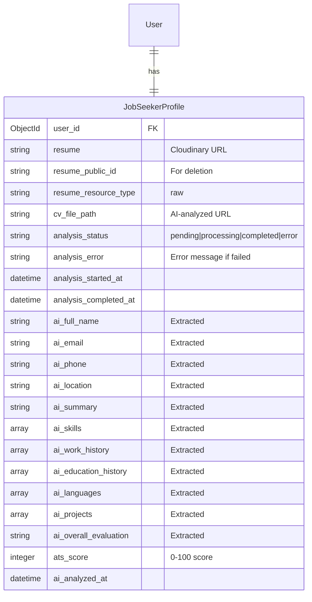
```mermaid
erDiagram
    User ||--|| JobSeekerProfile : "has"
    JobSeekerProfile {
        ObjectId user_id FK
        string resume "Cloudinary URL"
        string resume_public_id "For deletion"
        string resume_resource_type "raw"
        string cv_file_path "AI-analyzed URL"
        string analysis_status "pending|processing|completed|error"
        string analysis_error "Error message if failed"
        datetime analysis_started_at
        datetime analysis_completed_at
        string ai_full_name "Extracted"
        string ai_email "Extracted"
        string ai_phone "Extracted"
        string ai_location "Extracted"
        string ai_summary "Extracted"
        array ai_skills "Extracted"
        array ai_work_history "Extracted"
        array ai_education_history "Extracted"
        array ai_languages "Extracted"
        array ai_projects "Extracted"
        string ai_overall_evaluation "Extracted"
        integer ats_score "0-100 score"
        datetime ai_analyzed_at
    }
```

### 3.2 Pipeline Sequence

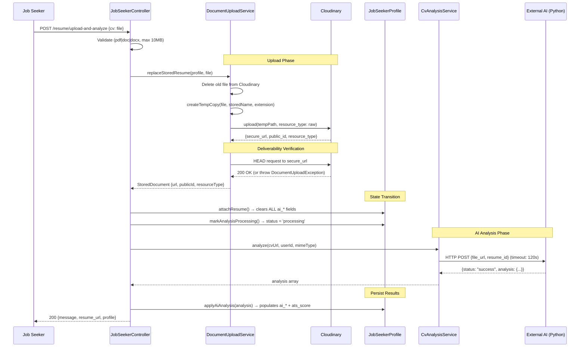
```mermaid
sequenceDiagram
    participant Seeker as Job Seeker
    participant Ctrl as JobSeekerController
    participant Upload as DocumentUploadService
    participant Cloud as Cloudinary
    participant Profile as JobSeekerProfile
    participant AI as CvAnalysisService
    participant ExtAI as External AI (Python)

    Seeker->>Ctrl: POST /resume/upload-and-analyze {cv: file}
    Ctrl->>Ctrl: Validate (pdf|doc|docx, max 10MB)

    Note over Upload, Cloud: Upload Phase
    Ctrl->>Upload: replaceStoredResume(profile, file)
    Upload->>Upload: Delete old file from Cloudinary
    Upload->>Upload: createTempCopy(file, storedName, extension)
    Upload->>Cloud: upload(tempPath, resource_type: raw)
    Cloud-->>Upload: {secure_url, public_id, resource_type}

    Note over Upload, Cloud: Deliverability Verification
    Upload->>Cloud: HEAD request to secure_url
    Cloud-->>Upload: 200 OK (or throw DocumentUploadException)
    Upload-->>Ctrl: StoredDocument {url, publicId, resourceType}

    Note over Profile: State Transition
    Ctrl->>Profile: attachResume() → clears ALL ai_* fields
    Ctrl->>Profile: markAnalysisProcessing() → status = 'processing'

    Note over AI, ExtAI: AI Analysis Phase
    Ctrl->>AI: analyze(cvUrl, userId, mimeType)
    AI->>ExtAI: HTTP POST {file_url, resume_id} (timeout: 120s)
    ExtAI-->>AI: {status: "success", analysis: {...}}
    AI-->>Ctrl: analysis array

    Note over Profile: Persist Results
    Ctrl->>Profile: applyAiAnalysis(analysis) → populates ai_* + ats_score
    Ctrl-->>Seeker: 200 {message, resume_url, profile}
```

### 3.3 Analysis State Machine

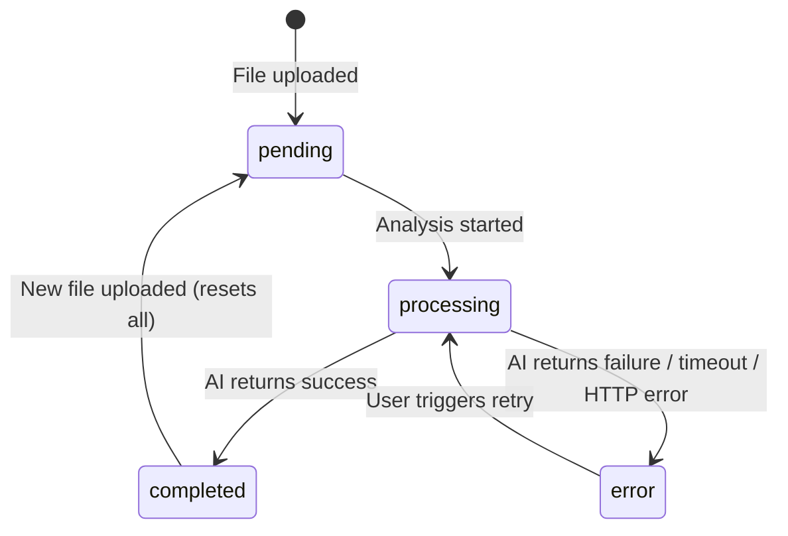
```mermaid
stateDiagram-v2
    [*] --> pending : File uploaded
    pending --> processing : Analysis started
    processing --> completed : AI returns success
    processing --> error : AI returns failure / timeout / HTTP error
    error --> processing : User triggers retry
    completed --> pending : New file uploaded (resets all)
```

### 3.4 Business Logic Deep-Dive

**Why this pipeline exists (Business Value)**

The CV analysis pipeline is the platform's core differentiator. Without it, the platform is just another job board. With it:

1. **For job seekers**: Uploading a CV auto-generates a structured profile (skills, education, work history) — eliminating tedious manual data entry. The ATS score tells them how "readable" their CV is before applying.

2. **For employers**: AI-extracted skills enable semantic search ("find all candidates with React + TypeScript + 3+ years"). Without extraction, employers rely on keyword search in free-text CVs — noisy and inaccurate.

3. **For the platform**: Every analyzed CV enriches the talent pool. The `ats_score` becomes a filterable metric that employers use to shortlist candidates, driving engagement.

**Why upload to Cloudinary first, then send the URL to the AI service?**

The platform chose URL-based analysis over streaming for several reasons:

- **Decoupled failure domains**: If the AI service is down, the file is already safely stored. The user can retry analysis later via `POST /resume/retry-analysis` without re-uploading.
- **Multi-service consumption**: The same URL is consumed by CV analysis, resume matching, and resume coach services — no duplication.
- **CDN performance**: Cloudinary provides a global CDN. The AI microservice (possibly in a different AWS region) fetches the file faster than receiving a multi-megabyte upload via the Laravel API server.
- **Audit trail**: The URL persists permanently. Admins can trigger re-analysis months later with `POST /admin/users/{userId}/reanalyze`.

**Why the deliverability HEAD request?**

This is defensive engineering against a real Cloudinary platform behaviour. Cloudinary silently blocks PDF delivery unless "Allow delivery of PDF and ZIP files" is enabled in the account console. Without this check:
- Upload succeeds → URL saved on profile → AI service fetches URL → gets 401 from Cloudinary → returns "could not extract text" → user sees a confusing error about their CV content

With the HEAD check:
- Upload succeeds → HEAD request to URL → gets 401 → throws `DocumentUploadException::notDeliverable()` → user sees "File could not be delivered. Contact support." → admin can fix the Cloudinary setting

The code (`DocumentUploadService.php`):
```php
public function assertDeliverable(StoredDocument $document): void
{
    try {
        $response = Http::timeout(20)->head($document->url);
    } catch (Throwable $e) {
        return; // Never block because the check itself failed
    }

    if ($response->successful()) return;

    throw DocumentUploadException::notDeliverable($document->url, $response->status());
}
```

Notice: if the HEAD check itself times out (network issue), it gracefully returns instead of blocking. The check is best-effort — false negatives (file actually undeliverable but check passes) are caught later by the AI service, while false positives (blocking a valid upload because Cloudinary CDN is slow) are avoided.

**Why clear AI fields on new upload?**

When a user uploads a new CV, old AI analysis becomes stale. Showing "AI Skills: React, Vue, Angular" from the old CV next to a new one that focuses on backend would mislead employers. The `attachResume()` method atomically resets everything:

```php
public function attachResume(StoredDocument $document): void
{
    $this->update([
        'resume' => $document->url,
        ...self::clearedAiAnalysis(),  // nulls all ai_* fields
        'analysis_status' => self::ANALYSIS_PENDING,
        'analysis_error' => null,
        'analysis_started_at' => now(),
        'analysis_completed_at' => null,
    ]);
}
```

**Why a state machine for analysis status?**

The analysis takes 30-120 seconds. Without status tracking:
- Frontend can't show a progress indicator (is it working? failed? done?)
- There's no way to distinguish "not analyzed" from "analysis in progress" from "analysis failed"
- The retry button wouldn't know if retrying is safe (you don't want to trigger two concurrent analyses)

The state machine gates retry to `error` state only:
```php
if ($profile->analysis_status !== 'error') {
    return response()->json([
        'message' => 'Analysis is not in error state. Current status: ' . $profile->analysis_status,
    ], 400);
}
```

---

## 4. Job Posting & Application System

### 4.1 Partial ERD

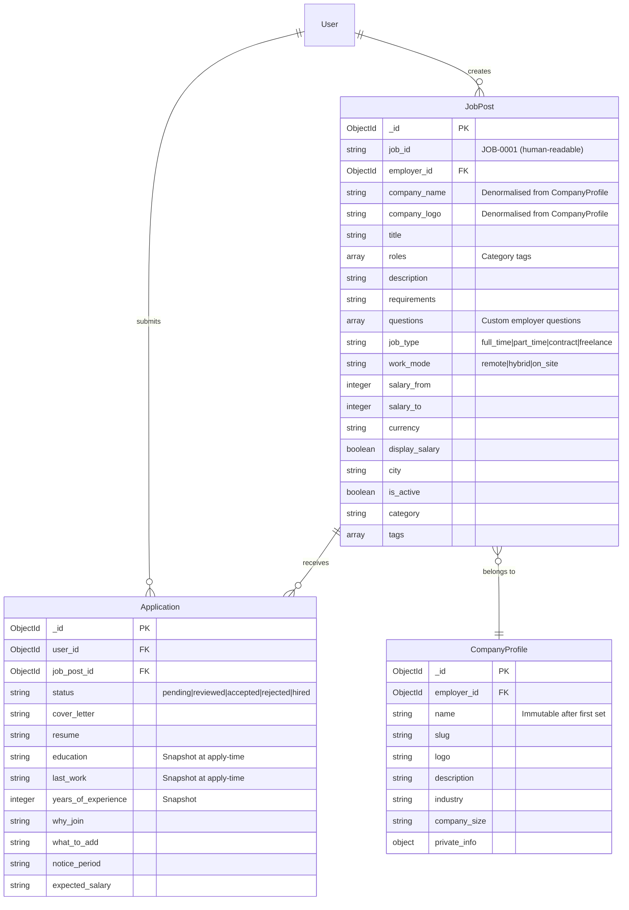
```mermaid
erDiagram
    User ||--o{ JobPost : "creates"
    User ||--o{ Application : "submits"
    JobPost ||--o{ Application : "receives"
    JobPost }o--|| CompanyProfile : "belongs to"

    JobPost {
        ObjectId _id PK
        string job_id "JOB-0001 (human-readable)"
        ObjectId employer_id FK
        string company_name "Denormalised from CompanyProfile"
        string company_logo "Denormalised from CompanyProfile"
        string title
        array roles "Category tags"
        string description
        string requirements
        array questions "Custom employer questions"
        string job_type "full_time|part_time|contract|freelance"
        string work_mode "remote|hybrid|on_site"
        integer salary_from
        integer salary_to
        string currency
        boolean display_salary
        string city
        boolean is_active
        string category
        array tags
    }

    Application {
        ObjectId _id PK
        ObjectId user_id FK
        ObjectId job_post_id FK
        string status "pending|reviewed|accepted|rejected|hired"
        string cover_letter
        string resume
        string education "Snapshot at apply-time"
        string last_work "Snapshot at apply-time"
        integer years_of_experience "Snapshot"
        string why_join
        string what_to_add
        string notice_period
        string expected_salary
    }

    CompanyProfile {
        ObjectId _id PK
        ObjectId employer_id FK
        string name "Immutable after first set"
        string slug
        string logo
        string description
        string industry
        string company_size
        object private_info
    }
```

### 4.2 Application Lifecycle

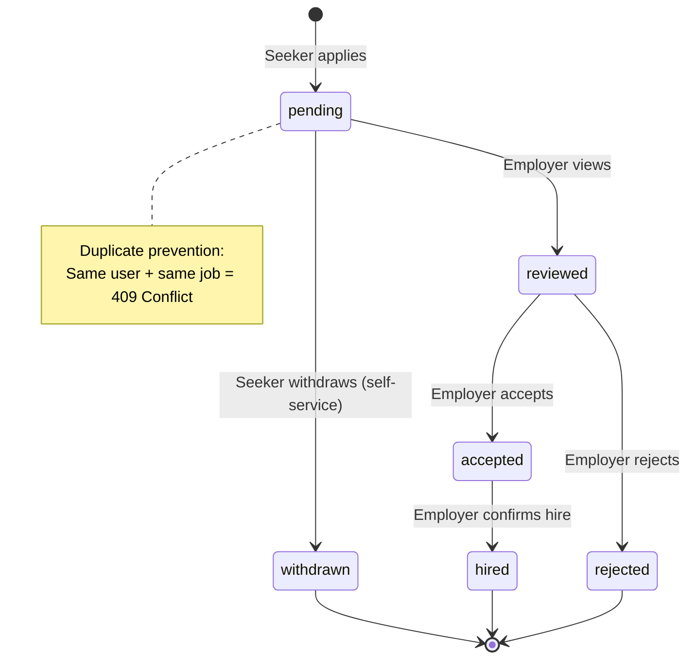
```mermaid
stateDiagram-v2
    [*] --> pending : Seeker applies
    pending --> reviewed : Employer views
    reviewed --> accepted : Employer accepts
    reviewed --> rejected : Employer rejects
    accepted --> hired : Employer confirms hire
    pending --> withdrawn : Seeker withdraws (self-service)
    withdrawn --> [*]
    hired --> [*]
    rejected --> [*]

    note right of pending
        Duplicate prevention:
        Same user + same job = 409 Conflict
    end note
```

### 4.3 Job Matching Scoring Algorithm

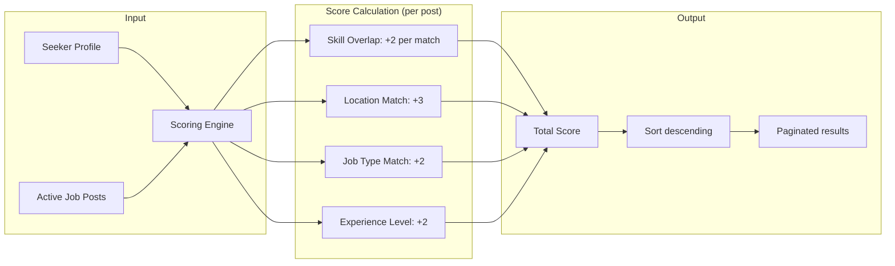
```mermaid
flowchart LR
    subgraph Input
        A[Seeker Profile] --> C[Scoring Engine]
        B[Active Job Posts] --> C
    end

    subgraph Scoring["Score Calculation (per post)"]
        C --> D[Skill Overlap: +2 per match]
        C --> E[Location Match: +3]
        C --> F[Job Type Match: +2]
        C --> G[Experience Level: +2]
    end

    subgraph Output
        D --> H[Total Score]
        E --> H
        F --> H
        G --> H
        H --> I[Sort descending]
        I --> J[Paginated results]
    end
```

### 4.4 Business Logic Deep-Dive

**Why denormalise `company_name` and `company_logo` on JobPost?**

Job listing pages are the highest-traffic pages on any job board. Each listing shows the company name and logo. In MongoDB, there are no JOINs — fetching related data requires separate queries. The options are:

| Approach | Queries for 20 jobs | Tradeoff |
|----------|-------------------:|----------|
| Normalised (lookup per post) | 21 queries (1 list + 20 company lookups) | Consistent but slow |
| `$lookup` aggregation | 1 query (with pipeline) | Complex, driver-version-sensitive |
| **Denormalised** | **1 query** | Fast, but data duplication |

The platform chose denormalisation because:
- Job listing pages are read 1000x more often than company names change
- The denormalised data is set at creation time, creating a **point-in-time snapshot** — if a company rebrands, old job posts correctly show the name they were posted under
- MongoDB's document model is designed for this pattern

**Why human-readable `job_id` (JOB-0001)?**

MongoDB ObjectIds (`664f1a2b3c4d5e6f7a8b9c0d`) are:
- Impossible to communicate verbally ("apply to six-six-four-eff-one-ay...")
- Too long for email subject lines or SMS
- Not meaningful to humans

The `JOB-XXXX` format enables:
- Customer support: "I have an issue with JOB-0042"
- Email campaigns: "New matches for JOB-0015"
- Internal discussion: "The JOB-0100 posting has quality issues"
- The ObjectId remains available for programmatic use

**Why embed applicant profile fields at application time?**

When a job seeker applies, the Application stores a **snapshot** of their key profile data:
```php
'education'           => $profile->education_level,
'last_work'           => $profile->current_job_title,
'years_of_experience' => $profile->years_of_experience,
'expected_salary'     => $request->input('expected_salary'),
```

This solves two problems:
1. **Historical accuracy**: If the seeker updates their profile after applying (adds 2 more years of experience, changes salary expectation), the employer sees what was true *at application time*
2. **Query efficiency**: Employers reviewing 50 applications don't need 50 profile lookups — the relevant data is inline

**Why the weighted matching algorithm?**

The local matching algorithm (no external AI call needed) provides fast, free recommendations:
- **Skills get +2 each** because they're the strongest fit signal and accumulate (5 matching skills = 10 points, creating clear differentiation)
- **Location gets +3 as a one-time bonus** because relocation is often a hard constraint — a single location match outweighs a single skill match, reflecting that geography often trumps minor skill gaps
- **Job type gets +2** because work arrangement (remote vs on-site) is a dealbreaker for many seekers
- **Experience level gets +2** because a senior applying to entry-level (or vice versa) is rarely a good fit

The algorithm combines AI-extracted skills (`ai_skills`) with manually-entered skills for maximum coverage:
```php
private function collectSeekerSkills(JobSeekerProfile $profile): array
{
    $skills = array_map('strtolower', (array) ($profile->ai_skills ?? []));
    foreach ((array) ($profile->skills ?? []) as $s) {
        if (is_array($s) && isset($s['name'])) {
            $skills[] = strtolower($s['name']);
        }
    }
    return array_unique(array_filter($skills));
}
```

---

## 5. Meeting & Scheduling System

### 5.1 Partial ERD

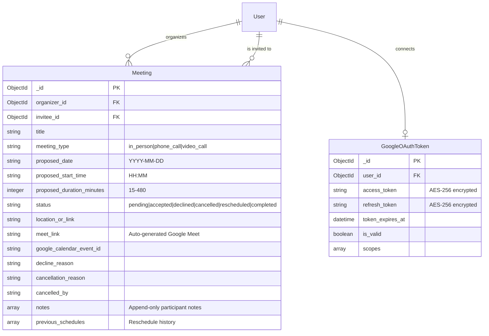
```mermaid
erDiagram
    User ||--o{ Meeting : "organizes"
    User ||--o{ Meeting : "is invited to"
    User ||--o| GoogleOAuthToken : "connects"

    Meeting {
        ObjectId _id PK
        ObjectId organizer_id FK
        ObjectId invitee_id FK
        string title
        string meeting_type "in_person|phone_call|video_call"
        string proposed_date "YYYY-MM-DD"
        string proposed_start_time "HH:MM"
        integer proposed_duration_minutes "15-480"
        string status "pending|accepted|declined|cancelled|rescheduled|completed"
        string location_or_link
        string meet_link "Auto-generated Google Meet"
        string google_calendar_event_id
        string decline_reason
        string cancellation_reason
        string cancelled_by
        array notes "Append-only participant notes"
        array previous_schedules "Reschedule history"
    }

    GoogleOAuthToken {
        ObjectId _id PK
        ObjectId user_id FK
        string access_token "AES-256 encrypted"
        string refresh_token "AES-256 encrypted"
        datetime token_expires_at
        boolean is_valid
        array scopes
    }
```

### 5.2 Meeting Lifecycle

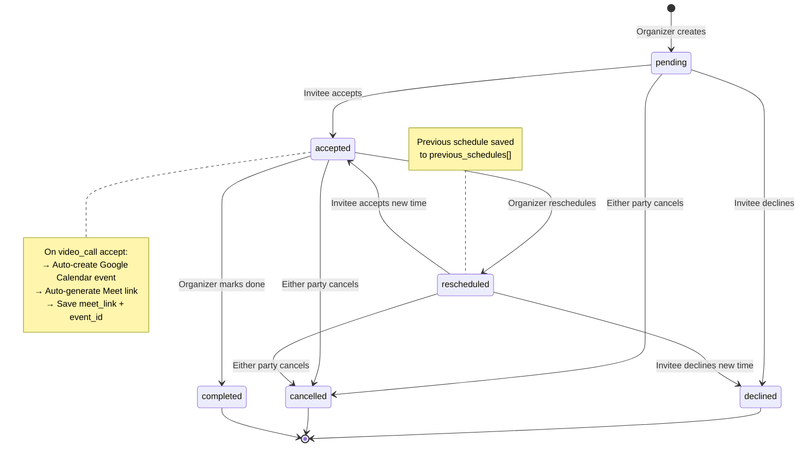
```mermaid
stateDiagram-v2
    [*] --> pending : Organizer creates

    pending --> accepted : Invitee accepts
    pending --> declined : Invitee declines
    pending --> cancelled : Either party cancels

    accepted --> completed : Organizer marks done
    accepted --> cancelled : Either party cancels
    accepted --> rescheduled : Organizer reschedules

    rescheduled --> accepted : Invitee accepts new time
    rescheduled --> declined : Invitee declines new time
    rescheduled --> cancelled : Either party cancels

    declined --> [*]
    cancelled --> [*]
    completed --> [*]

    note right of accepted
        On video_call accept:
        → Auto-create Google Calendar event
        → Auto-generate Meet link
        → Save meet_link + event_id
    end note

    note left of rescheduled
        Previous schedule saved
        to previous_schedules[]
    end note
```

### 5.3 Conflict Detection Algorithm

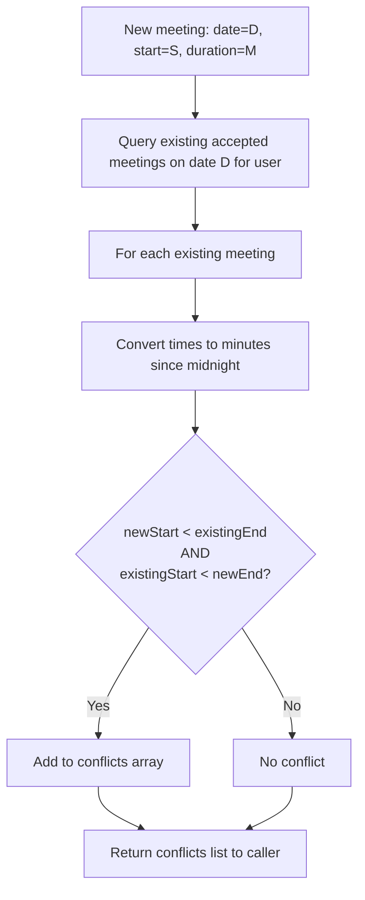
```mermaid
flowchart TD
    A[New meeting: date=D, start=S, duration=M] --> B[Query existing accepted meetings on date D for user]
    B --> C[For each existing meeting]
    C --> D[Convert times to minutes since midnight]
    D --> E{newStart < existingEnd<br/>AND<br/>existingStart < newEnd?}
    E -->|Yes| F[Add to conflicts array]
    E -->|No| G[No conflict]
    F --> H[Return conflicts list to caller]
    G --> H
```

### 5.4 Google Calendar Integration Flow

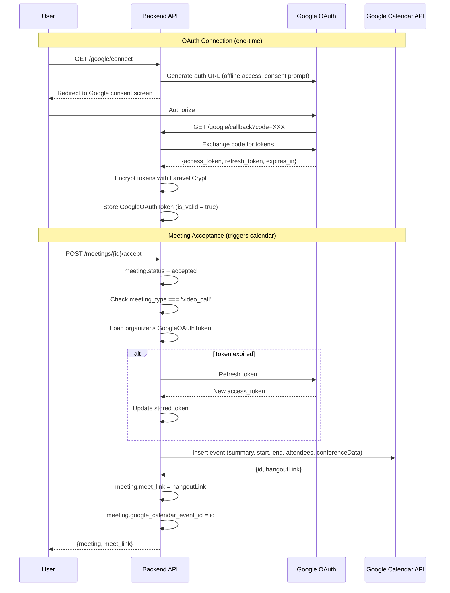
```mermaid
sequenceDiagram
    participant User
    participant API as Backend API
    participant Google as Google OAuth
    participant Calendar as Google Calendar API

    Note over User, Calendar: OAuth Connection (one-time)
    User->>API: GET /google/connect
    API->>Google: Generate auth URL (offline access, consent prompt)
    API-->>User: Redirect to Google consent screen
    User->>Google: Authorize
    Google->>API: GET /google/callback?code=XXX
    API->>Google: Exchange code for tokens
    Google-->>API: {access_token, refresh_token, expires_in}
    API->>API: Encrypt tokens with Laravel Crypt
    API->>API: Store GoogleOAuthToken (is_valid = true)

    Note over User, Calendar: Meeting Acceptance (triggers calendar)
    User->>API: POST /meetings/{id}/accept
    API->>API: meeting.status = accepted
    API->>API: Check meeting_type === 'video_call'
    API->>API: Load organizer's GoogleOAuthToken

    alt Token expired
        API->>Google: Refresh token
        Google-->>API: New access_token
        API->>API: Update stored token
    end

    API->>Calendar: Insert event (summary, start, end, attendees, conferenceData)
    Calendar-->>API: {id, hangoutLink}
    API->>API: meeting.meet_link = hangoutLink
    API->>API: meeting.google_calendar_event_id = id
    API-->>User: {meeting, meet_link}
```

### 5.5 Business Logic Deep-Dive

**Why meeting scheduling in a job platform?**

Hiring is fundamentally an interpersonal process. After an employer finds a candidate (via application or direct search), the next step is always a conversation — phone screen, video interview, or in-person meeting. Without built-in scheduling:
- Users leave the platform to coordinate via email (platform loses engagement data)
- Scheduling conflicts aren't detected (double-bookings waste everyone's time)
- There's no tracking of interview progress (how many meetings per hire?)

Built-in scheduling creates a **closed-loop hiring workflow**: search → offer/apply → schedule → meet → hire. Every step happens on-platform, providing data for analytics.

**Why enforce opposite-role meetings?**

```php
if ($user->hasRole('employer') && !$invitee->hasRole('employee')) {
    return response()->json(['message' => 'Invitee must be a job seeker'], 422);
}
```

The platform connects employers with seekers. Employer-to-employer meetings (networking) and seeker-to-seeker meetings (study groups) are out of scope. This constraint:
- Keeps the feature focused on hiring use cases
- Prevents abuse (spam meetings between unrelated users)
- Simplifies the UI (each side sees only relevant meeting options)

**Why the conflict detection algorithm uses minutes-since-midnight?**

Time overlap detection requires comparing intervals. Using raw `HH:MM` strings would require complex string parsing for every comparison. Converting to **minutes since midnight** transforms the problem into simple integer arithmetic:

```php
private function timeToMinutes(string $time): int
{
    $parts = explode(':', $time);
    return (int) $parts[0] * 60 + (int) $parts[1];
}

// "14:30" → 870 minutes
// "14:30" + 60min duration → ends at 930
// "15:00" → 900
// Is 870 < 930 AND 900 < 930? → Yes, overlap!
```

The overlap formula `startA < endB AND startB < endA` is mathematically proven to detect all overlap cases:
- Complete containment: A inside B, or B inside A
- Partial overlap: start of A during B, or end of A during B
- Exact match: A and B identical

Adjacent meetings (e.g., 10:00-11:00 and 11:00-12:00) do NOT conflict because the formula uses strict inequality (`<` not `<=`).

**Why non-blocking Google Calendar integration?**

The `GoogleMeetService` wraps every Calendar API call in try-catch and returns `null` on failure:
```php
} catch (\Throwable $e) {
    Log::error('Failed to create Google Calendar event with Meet link', [
        'meeting_id' => $meeting->_id,
        'error' => $e->getMessage(),
    ]);
    return null;
}
```

This design guarantees that:
- Google API outages never prevent meeting acceptance
- Expired/revoked tokens don't break the meeting workflow
- Network timeouts don't leave meetings in an inconsistent state

The meeting is accepted regardless; the calendar event is best-effort. If the link isn't generated, the response includes `google_meet_warning` explaining why.

**Why append-only notes and `previous_schedules`?**

Meeting notes are shared between participants. Making them immutable prevents:
- One party retroactively changing what was discussed ("I never said that salary")
- Evidence tampering in dispute resolution
- The notes serve as a lightweight meeting minutes system

The `previous_schedules` array provides full reschedule history:
```php
$previousSchedules[] = [
    'proposed_date' => $meeting->proposed_date,
    'proposed_start_time' => $meeting->proposed_start_time,
    'proposed_duration_minutes' => $meeting->proposed_duration_minutes,
];
```
This enables admin oversight ("this meeting has been rescheduled 5 times — is there a problem?") and participant reference ("what was the original time we agreed on?").

---

## 6. Direct Offers System

### 6.1 Partial ERD

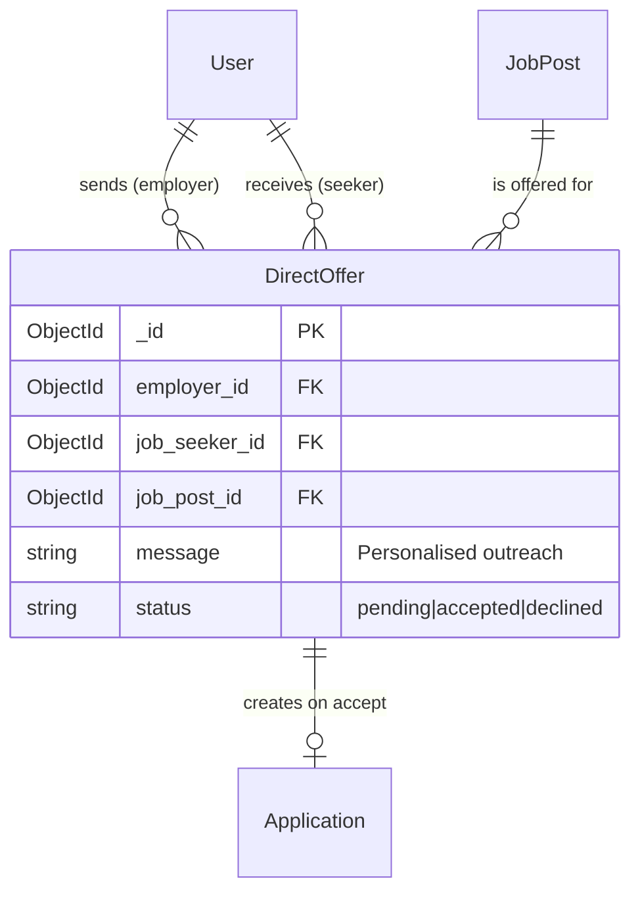
```mermaid
erDiagram
    User ||--o{ DirectOffer : "sends (employer)"
    User ||--o{ DirectOffer : "receives (seeker)"
    JobPost ||--o{ DirectOffer : "is offered for"
    DirectOffer ||--o| Application : "creates on accept"

    DirectOffer {
        ObjectId _id PK
        ObjectId employer_id FK
        ObjectId job_seeker_id FK
        ObjectId job_post_id FK
        string message "Personalised outreach"
        string status "pending|accepted|declined"
    }
```

### 6.2 Offer Acceptance Flow

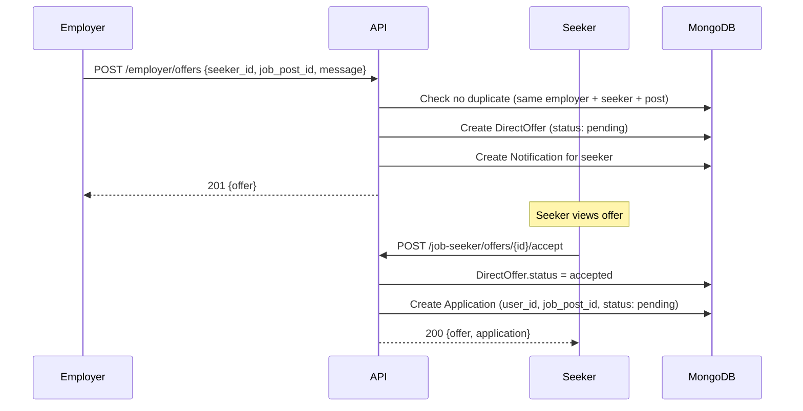
```mermaid
sequenceDiagram
    participant Employer
    participant API
    participant Seeker
    participant DB as MongoDB

    Employer->>API: POST /employer/offers {seeker_id, job_post_id, message}
    API->>DB: Check no duplicate (same employer + seeker + post)
    API->>DB: Create DirectOffer (status: pending)
    API->>DB: Create Notification for seeker
    API-->>Employer: 201 {offer}

    Note over Seeker: Seeker views offer

    Seeker->>API: POST /job-seeker/offers/{id}/accept
    API->>DB: DirectOffer.status = accepted
    API->>DB: Create Application (user_id, job_post_id, status: pending)
    API-->>Seeker: 200 {offer, application}
```

### 6.3 Business Logic Deep-Dive

**Why Direct Offers exist alongside normal applications?**

Two-sided marketplaces require **bidirectional engagement**:

| Flow | Initiator | Use Case |
|------|-----------|----------|
| Application | Job Seeker | Seeker finds a job, actively applies |
| Direct Offer | Employer | Employer finds talent, proactively recruits |

This mirrors real-world recruiting:
- LinkedIn InMail (employer reaches out to passive candidates)
- Recruiter calls (head-hunting for hard-to-fill roles)
- Job fairs (mutual discovery)

Without direct offers, the platform only serves actively-seeking candidates. With them, passive candidates (employed but open to better offers) become reachable — this segment is typically higher quality and harder to attract.

**Why auto-create Application on acceptance?**

When a seeker accepts a direct offer, an Application is automatically created:
```php
Application::create([
    'user_id' => $offer->job_seeker_id,
    'job_post_id' => $offer->job_post_id,
    'status' => 'pending',
]);
```

This unifies the tracking pipeline. From this point, the employer manages the candidate through the same Application status flow (reviewed → accepted → hired) regardless of whether they applied normally or accepted an offer. Benefits:
- Single analytics pipeline (all candidates tracked the same way)
- No separate "offer tracking" UI needed
- Application statistics remain accurate

**Why prevent duplicate offers?**

An employer sending the same offer twice is either:
- A bug (button double-click) → duplicate prevention saves UX
- Intentional harassment → duplicate prevention is a safety feature

---

## 7. Admin Business Intelligence & Analytics

### 7.1 Analytics Data Flow

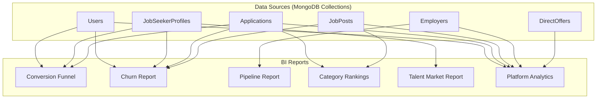
```mermaid
flowchart TB
    subgraph DataSources["Data Sources (MongoDB Collections)"]
        U[Users]
        JP[JobPosts]
        A[Applications]
        E[Employers]
        JSP[JobSeekerProfiles]
        DO[DirectOffers]
    end

    subgraph Reports["BI Reports"]
        F[Conversion Funnel]
        CH[Churn Report]
        P[Pipeline Report]
        CAT[Category Rankings]
        T[Talent Market Report]
        AN[Platform Analytics]
    end

    U --> F
    U --> CH
    U --> AN
    JSP --> F
    JSP --> CH
    JSP --> T
    A --> F
    A --> CH
    A --> CAT
    A --> AN
    JP --> CH
    JP --> CAT
    JP --> AN
    E --> P
    E --> AN
    DO --> AN
```

### 7.2 Conversion Funnel (with Monotonic Clamping)

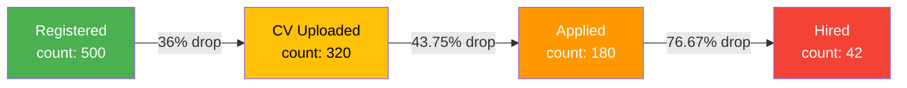
```mermaid
flowchart LR
    R[Registered<br/>count: 500] -->|"36% drop"| CV[CV Uploaded<br/>count: 320]
    CV -->|"43.75% drop"| AP[Applied<br/>count: 180]
    AP -->|"76.67% drop"| H[Hired<br/>count: 42]

    style R fill:#4CAF50,color:white
    style CV fill:#FFC107,color:black
    style AP fill:#FF9800,color:white
    style H fill:#F44336,color:white
```

### 7.3 Revenue Impact Pipeline

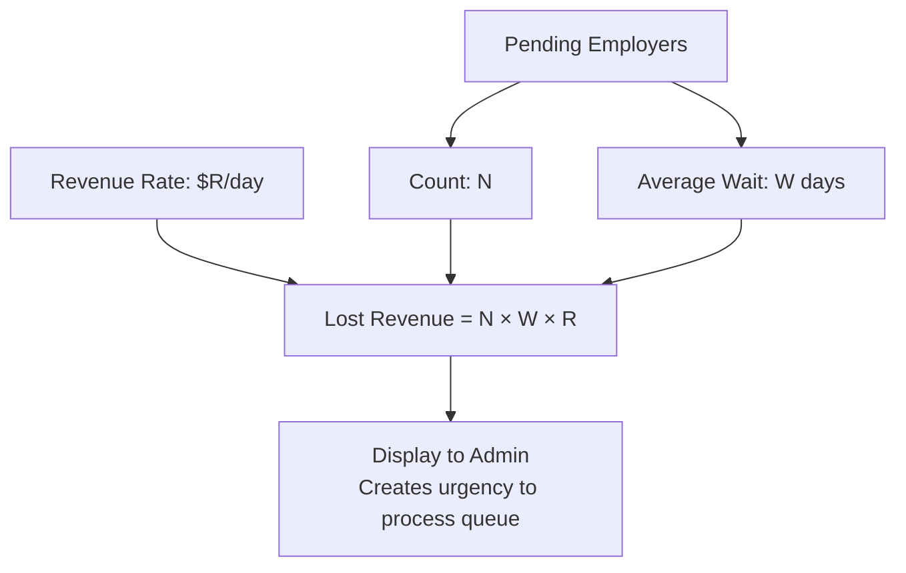
```mermaid
flowchart TD
    A[Pending Employers] --> B[Count: N]
    A --> C[Average Wait: W days]
    D[Revenue Rate: $R/day] --> E[Lost Revenue = N × W × R]

    B --> E
    C --> E
    E --> F[Display to Admin<br/>Creates urgency to process queue]
```

### 7.4 Business Logic Deep-Dive

**Conversion Funnel with Monotonic Clamping — Why It Matters**

The funnel computes four stages: `registered → cv_uploaded → applied → hired`. In theory, each stage should be ≤ the previous (you can't apply without registering). In practice, data inconsistencies can violate this:
- A user registers, uploads CV, then their account is deleted (cv_uploaded > registered)
- Database migration errors create orphaned Application records
- Race conditions during concurrent operations

The service enforces mathematical validity:
```php
// Clamp each stage to not exceed the previous (data integrity guard)
$cvUploaded = min($cvUploaded, $registered);
$applied    = min($applied,    $cvUploaded);
$hired      = min($hired,      $applied);
```

**Why this property matters for business:**
A funnel showing 500 registered → 600 CV uploaded instantly destroys credibility with stakeholders. Even if the "real" number is 600 (due to a migration artefact), presenting it undermines trust in all platform metrics. The clamp ensures reports are always logically valid, even when the data isn't perfectly clean.

The drop-off formula handles the division-by-zero edge case:
```php
private function dropOff(int $prev, int $curr): float
{
    if ($prev === 0) return 0.0;
    return round((($prev - $curr) / $prev) * 100, 2);
}
```

**Employer Approval Pipeline with Revenue Impact — Why It Drives Action**

Every pending employer is a potential revenue source sitting idle:
```php
$estimatedLostRevenue = $pendingCount * $avgWaitDays * $rate;
// Example: 5 pending × 3.2 avg days × $10/day = $160 estimated loss
```

This report transforms an abstract backlog ("5 pending applications") into a financial metric ("$160 lost revenue"). This:
- Creates urgency for admins to process the queue
- Provides justification for hiring more admin staff
- Enables SLA tracking (if avg_wait_days > threshold, escalate)
- The configurable `$rate` allows different platform stages to use appropriate values

**Privacy-Safe Talent Market Reports — K-Anonymity Enforcement**

The `TalentReportService` implements a form of k-anonymity:

```php
private const PII_FIELDS = [
    'name', 'email', 'phone', 'user_id',
    'ai_email', 'ai_phone', 'ai_full_name', 'ai_location',
];

if ($profiles->count() < 5) {
    throw new \InvalidArgumentException('Insufficient data for anonymized report');
}
```

**Why minimum 5?**
If only 3 people match a filter (e.g., "AI engineers in Damascus"), and you report their aggregated ATS scores, an insider who knows 2 of them can deduce the third's score. With 5+ profiles, individual re-identification becomes statistically difficult.

**Why an explicit PII blocklist?**
The "deny by default" approach (list fields that MUST be excluded) is safer than "allow by default" (list fields that CAN be included). If a developer adds a new field `ai_home_address` to the model, it will NOT accidentally appear in reports — it must be explicitly removed from PII_FIELDS first.

**Churn Detection — Two-Sided Re-Engagement**

The churn report identifies at-risk users from both marketplace sides:

| Segment | Definition | Business Action |
|---------|-----------|-----------------|
| Churned Employer | Has employer role + no posts within window (30/60/90 days) | Sales outreach, ask about posting needs |
| Churned Seeker | Has uploaded CV + zero applications ever | UX survey, push notifications with matched jobs |

The employer definition uses a configurable window because seasonality matters — a university career center may post quarterly, not monthly. The 30/60/90 options allow admins to tune sensitivity.

The seeker definition ("has CV but no applications") identifies a specific drop-off point: they invested significant effort (uploading and waiting for analysis) but something prevented them from taking the next step. This could be:
- Poor job quality on the platform
- Intimidating application forms
- Technical issues with the apply flow
- Salary expectations not met by available jobs

---

## 8. Notification Architecture

### 8.1 Partial ERD

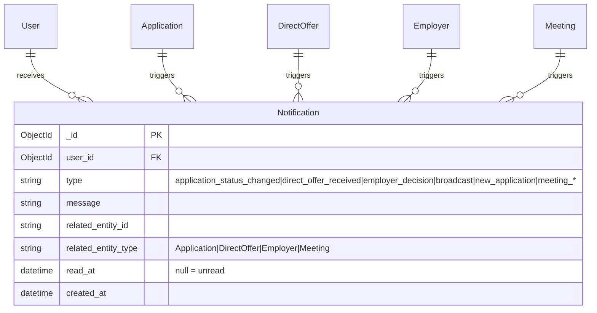
```mermaid
erDiagram
    User ||--o{ Notification : "receives"
    Application ||--o{ Notification : "triggers"
    DirectOffer ||--o{ Notification : "triggers"
    Employer ||--o{ Notification : "triggers"
    Meeting ||--o{ Notification : "triggers"

    Notification {
        ObjectId _id PK
        ObjectId user_id FK
        string type "application_status_changed|direct_offer_received|employer_decision|broadcast|new_application|meeting_*"
        string message
        string related_entity_id
        string related_entity_type "Application|DirectOffer|Employer|Meeting"
        datetime read_at "null = unread"
        datetime created_at
    }
```

### 8.2 Observer Event Flow

```mermaid
flowchart TD
    subgraph Triggers["Model Events"]
        A1[Application.created]
        A2[Application.updated<br/>status changed]
        D1[DirectOffer.created]
        E1[Employer.updated<br/>status = approved/rejected]
    end

    subgraph Observer["NotificationObserver"]
        O[Polymorphic dispatch<br/>by model type]
    end

    subgraph Actions["Side Effects"]
        N[Create Notification<br/>in-app]
        EM[Dispatch Email<br/>via Laravel Notifications<br/>queued]
    end

    A1 --> O
    A2 --> O
    D1 --> O
    E1 --> O
    O --> N
    O --> EM

    subgraph MeetingNotifs["MeetingNotificationService<br/>(Explicit calls, not observer)"]
        M1[notifyInvitation]
        M2[notifyAccepted]
        M3[notifyDeclined]
        M4[notifyCancelled]
        M5[notifyRescheduled]
    end
```

### 8.3 Business Logic Deep-Dive

**Why the Observer pattern for notifications?**

The `NotificationObserver` is registered globally on Application, DirectOffer, and Employer models. This means notifications fire regardless of *where* the model is modified:
- From a controller (normal API call)
- From a service class (background processing)
- From an artisan command (admin bulk operation)
- From a queued job (async processing)

Without observers, every code path that updates `Application.status` would need to manually create a notification — fragile and error-prone. With observers, the notification is guaranteed.

**Why polymorphic handling in a single observer?**

```php
public function updated(mixed $model): void
{
    if ($model instanceof Application) { $this->handleApplicationUpdated($model); }
    elseif ($model instanceof DirectOffer) { $this->handleDirectOfferUpdated($model); }
    elseif ($model instanceof Employer) { $this->handleEmployerUpdated($model); }
}
```

All notification logic lives in one file. When debugging "why didn't the user get notified?", there's exactly one place to look. This is a conscious trade-off: it sacrifices separation (one file does three things) for discoverability (one file to find and read).

**Why meetings use a separate notification service instead of the observer?**

Meeting notifications have complex recipient logic:
- Invitation → notify invitee
- Accepted → notify organizer
- Declined → notify organizer
- Cancelled → notify the *other* party (whoever didn't cancel)
- Rescheduled → notify invitee

The "who gets notified" logic varies per action and requires context (who triggered the action) that observers don't naturally receive. The explicit `MeetingNotificationService` is called from `MeetingService` with full context:
```php
public function notifyCancelled(Meeting $meeting, string $cancelledByUserId): void
{
    $recipientId = $meeting->organizer_id === $cancelledByUserId
        ? $meeting->invitee_id
        : $meeting->organizer_id;
    // ...
}
```

**Why both in-app AND email?**
- **In-app**: instant feedback for active users, supports badge counts, no email fatigue
- **Email**: reaches inactive users, creates urgency ("you got a job offer!"), works when app is closed
- Emails are queued (`ShouldQueue`) to avoid slowing down API responses

---

## 9. Resume Coach AI System

### 9.1 Partial ERD

```mermaid
erDiagram
    User ||--o{ CoachSession : "creates"
    CoachSession ||--o{ CoachMessage : "contains"

    CoachSession {
        ObjectId _id PK
        ObjectId user_id FK
        string title
        datetime created_at
        datetime updated_at
    }

    CoachMessage {
        ObjectId _id PK
        ObjectId session_id FK
        string role "user|assistant"
        string content
        datetime created_at
    }
```

### 9.2 Chat Flow

```mermaid
sequenceDiagram
    participant Seeker
    participant Controller as ResumeCoachController
    participant Service as ResumeCoachService
    participant DB as MongoDB
    participant AI as External AI Service

    Seeker->>Controller: POST /coach/chat {message, ?session_id}
    Controller->>Controller: Validate (message max 1000 chars)

    alt No session_id provided
        Controller->>Service: chat(userId, message, null)
        Service->>DB: Create new CoachSession
    else session_id provided
        Controller->>Service: chat(userId, message, sessionId)
        Service->>DB: Load existing session + all messages
    end

    Service->>DB: Store user message (role: "user")
    Service->>AI: POST {message, history[]} (timeout: 60s)
    AI-->>Service: {response: "Here are tips..."}
    Service->>DB: Store AI response (role: "assistant")
    Service-->>Controller: {response, session_id}
    Controller-->>Seeker: 200 {response, session_id}
```

### 9.3 Business Logic Deep-Dive

**Why a conversational AI coach instead of a one-shot analysis?**

One-shot CV analysis tells users "your ATS score is 65" — but doesn't help them improve. The resume coach provides an iterative improvement loop:

1. User: "How can I improve my resume?"
2. Coach: "Your skills section lists 12 items. Employers prefer 6-8 targeted skills. Which role are you targeting?"
3. User: "Frontend React developer"
4. Coach: "Remove 'Microsoft Word' and 'Team Player'. Add 'TypeScript', 'Next.js', and 'Testing Library'. Here's why..."

This multi-turn interaction model:
- Provides personalised guidance (not generic tips)
- Adapts to the user's specific resume and career goals
- Increases platform engagement (users return for follow-up sessions)
- Generates data on common resume problems (product insight)

**Why persistent sessions?**

Sessions persist in MongoDB because:
- Users may leave mid-conversation and return hours/days later
- The AI service needs full conversation history for context-aware responses
- Analytics: "What do users ask about most?" → guides feature development
- Users can reference past coaching sessions when updating their CV

**Why separate Session and Message collections?**

In document databases, the temptation is to embed messages within the session document. However:
- Sessions may accumulate 30+ messages (Mongo documents have a 16MB limit — not a concern here, but unbounded growth is an anti-pattern)
- Listing sessions (just title + date, no messages) is a common query that should be fast
- Messages need independent `created_at` for ordering and potential pagination

---

## 10. Bulk B2B Onboarding System

### 10.1 Processing Flow

```mermaid
sequenceDiagram
    participant Admin
    participant Controller as BulkOnboardingController
    participant Service as BulkOnboardingService
    participant CSV as League CSV Parser
    participant DB as MongoDB
    participant Queue as Laravel Queue

    Admin->>Controller: POST /admin/onboarding/bulk {file: CSV}
    Controller->>Controller: Validate (BulkOnboardingRequest: csv, max 2MB)
    Controller->>Service: process(file, actorId, actorName)

    Service->>CSV: Parse headers
    Service->>Service: Validate required columns (name, email, company_name)

    loop For each row
        Service->>Service: Normalize keys, trim values
        alt Missing required fields
            Service->>Service: skipped++ / record reason
        else Email already exists
            Service->>DB: User::where('email', email)->exists()
            Service->>Service: skipped++ / record "email_exists"
        else Valid row
            Service->>DB: Create User (roles: ['employer'], temp password)
            Service->>DB: Create Employer (status: pending, partner_type)
            Service->>Queue: Dispatch SendBulkInviteJob
            Service->>Service: created++
        end
    end

    Service->>DB: AuditLogService::log('bulk_employer_onboarded', metadata)
    Service-->>Controller: {total_rows, created, skipped, skipped_rows}
    Controller-->>Admin: 200 {result}
```

### 10.2 Correctness Property Diagram

```mermaid
flowchart LR
    T[total_rows] --> V{Validation}
    V -->|Valid + New| C[created]
    V -->|Missing fields| S1[skipped]
    V -->|Duplicate email| S2[skipped]

    C --> I[INVARIANT:<br/>created + skipped = total_rows]
    S1 --> I
    S2 --> I
```

### 10.3 Business Logic Deep-Dive

**Why bulk onboarding exists**

B2B sales in job marketplaces often close deals with organisations that bring multiple employer accounts:
- **Recruitment agencies**: 20+ recruiters who each need their own posting account
- **University career centers**: one contract, multiple departments posting internships
- **Enterprise clients**: HR teams across different divisions

Manual registration of 50 accounts is:
- Error-prone (typos in emails → lost invite links)
- Time-consuming (15 minutes × 50 = 12.5 hours of admin time)
- Untraceable (who created what, when?)

The CSV bulk import solves all three: automated, audited, and fault-tolerant.

**The `created + skipped = total_rows` invariant**

This correctness property is explicitly documented in the service code:
```php
/**
 * Property 6: created + skipped = total_rows; no duplicate emails after processing.
 */
```

Every single row in the CSV is accounted for. No row is silently dropped. This enables:
- **Admin verification**: "I uploaded 50 rows and got 48 created + 2 skipped. The 2 skipped are listed with reasons. Everything checks out."
- **Debugging**: If `created + skipped ≠ total_rows`, there's a bug in the loop logic
- **Business reporting**: "Out of 200 leads from the conference, 180 were new and 20 already existed"

**Why partial failure handling (skip-and-continue)?**

The alternative is "fail on first error" — if row 3 has a bad email, abort the entire import. This is problematic because:
- Admins must fix one row, re-upload the entire file, and re-process all the good rows
- Already-created accounts from rows 1-2 would be duplicated on re-upload
- A single typo blocks 49 valid accounts

The skip-and-continue approach:
- Processes everything it can
- Reports everything it skipped (with reasons)
- Lets admin fix only the failed rows and re-upload a smaller CSV
- The duplicate email check prevents re-processing already-created accounts

**Why asynchronous invite emails?**

```php
SendBulkInviteJob::dispatch((string) $user->_id, $companyName, $tempPassword);
```

Sending emails synchronously for 50 accounts would take 30-60 seconds (SMTP latency per email). The queued approach:
- Returns the API response immediately (admin doesn't wait)
- Emails are sent in parallel by queue workers
- Failed emails can be retried without re-running the entire import
- Audit log is written immediately regardless of email delivery success

---

## Summary: Decision Matrix

| System | Key Decision | Technical Why | Business Why |
|--------|-------------|--------------|--------------|
| Auth | JWT + double-lock employer gate | Stateless, scalable, can't bypass with role alone | Platform trust, fraud prevention |
| CV Pipeline | URL-based AI + state machine + deliverability check | Decoupled failures, retry support, defensive engineering | Never lose user's uploaded file, clear progress feedback |
| Jobs | Denormalised company data + human IDs + eager fields | Single-query listings, readable references, point-in-time snapshots | Fast pages, verbal communication, fair historical evaluation |
| Meetings | Minutes-since-midnight + non-blocking Calendar + append-only notes | Simple integer math, graceful degradation, immutable audit | No double-bookings, Google outages don't break workflow, dispute resolution |
| Offers | Auto-create Application on accept + duplicate prevention | Unified pipeline, idempotent operations | Consistent tracking regardless of entry point |
| Analytics | Monotonic clamping + revenue formula + k-anonymity | Mathematical validity, actionable metrics, privacy compliance | Trustworthy reports, urgency creation, legal safety |
| Notifications | Observer pattern + explicit meeting service | Guaranteed consistency, flexible recipient logic | Every user stays informed, no silent failures |
| Coach | Persistent multi-turn sessions + separate collections | Context-aware AI, efficient queries | Iterative improvement loop, increased engagement |
| Bulk Onboarding | Skip-and-continue + invariant tracking + async emails | Fault tolerance, auditability, fast responses | Scales B2B sales, transparent outcomes |
