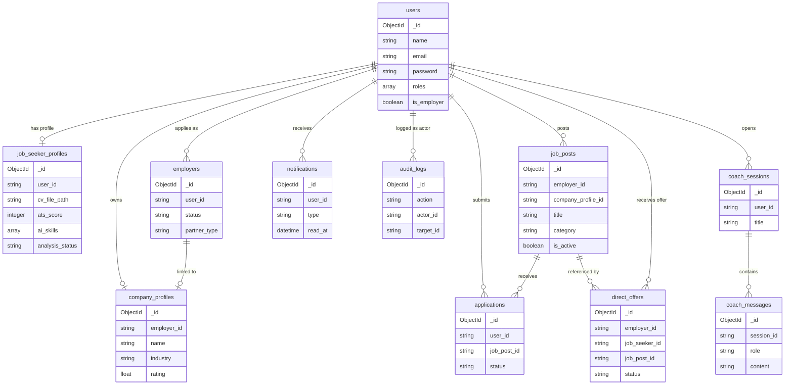
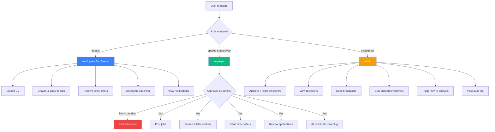
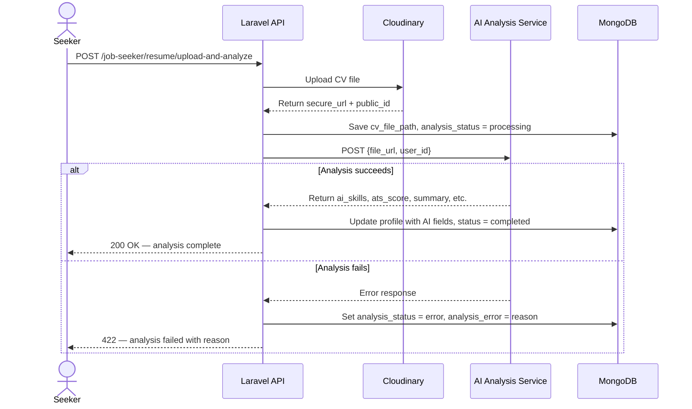
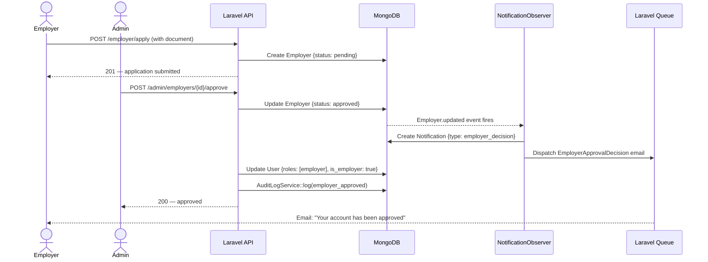
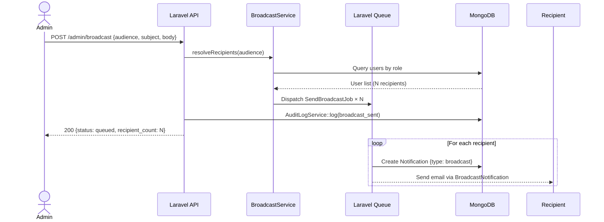
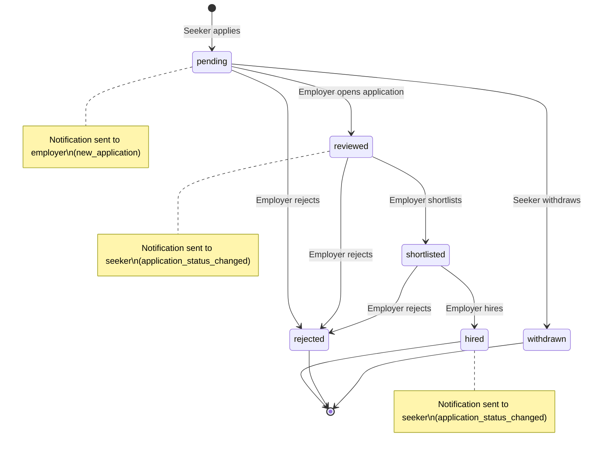
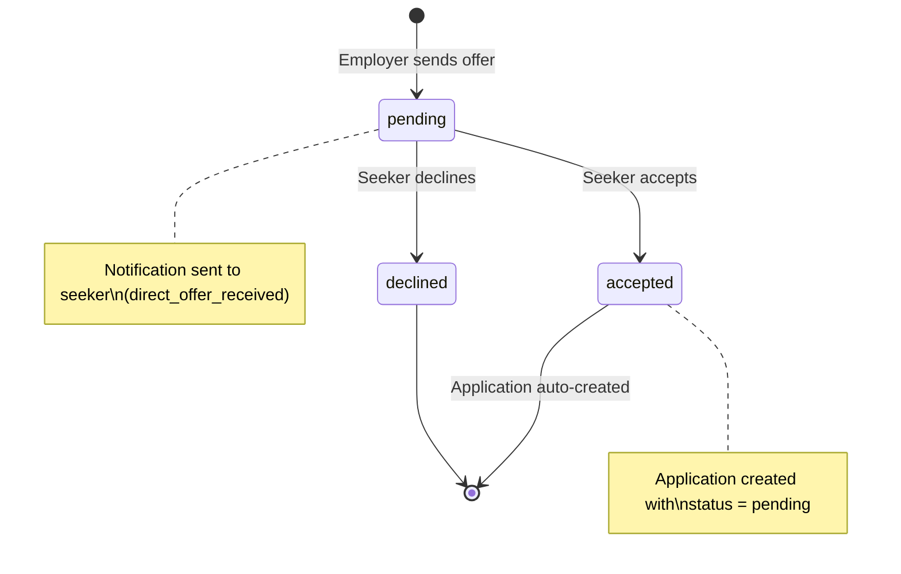
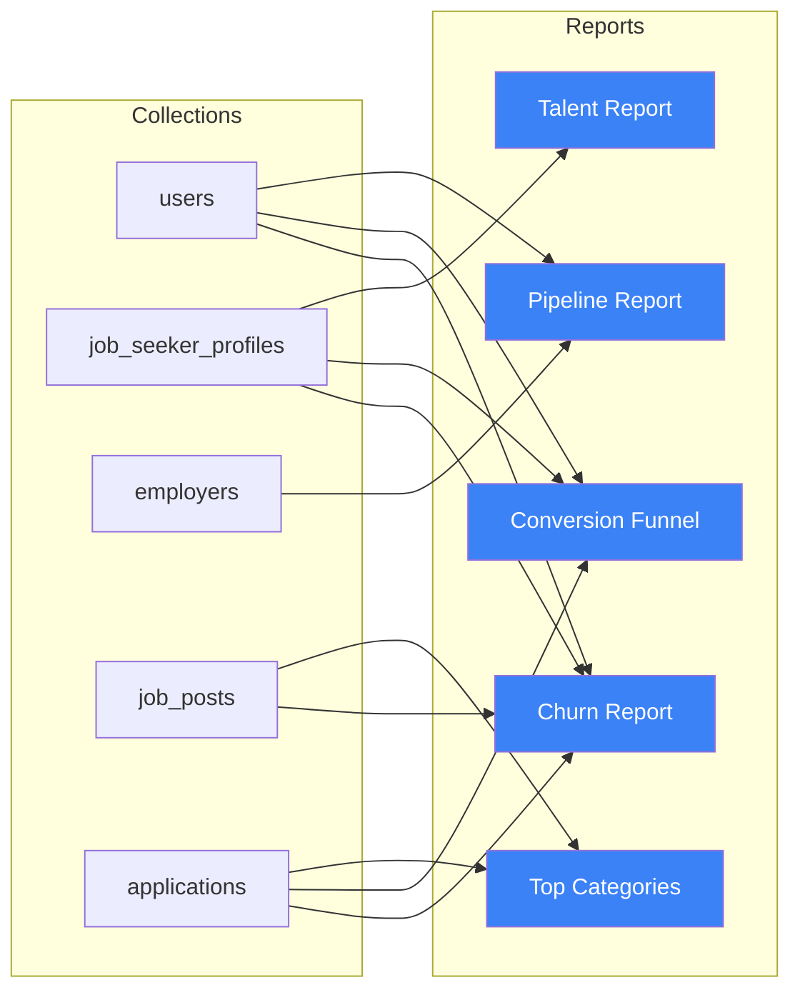
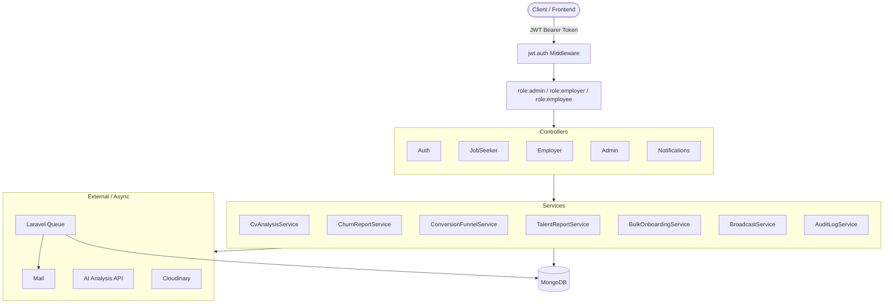

# Platform Diagrams

> All diagrams use [Mermaid](https://mermaid.js.org/). Render in GitHub, Notion, VS Code (Markdown Preview Mermaid Support extension), or [mermaid.live](https://mermaid.live).

---

## 1. Database — Collection Relationships

---

## 2. User Roles & Access Control

---

## 3. CV Upload & AI Analysis Flow

---

## 4. Employer Approval & Notification Flow

---

## 5. Admin Broadcast Flow

---

## 6. Application Lifecycle

---

## 7. Direct Offer Lifecycle

---

## 8. Admin BI Report Dependencies

---

## 9. API Layer Architecture

---

## Rendering Options

| Tool | How |
|---|---|
| **GitHub** | Paste into any `.md` file — renders automatically |
| **mermaid.live** | Paste diagram code at [mermaid.live](https://mermaid.live) |
| **VS Code** | Install "Markdown Preview Mermaid Support" extension |
| **Notion** | Use a `/code` block, set language to `mermaid` |
| **Obsidian** | Renders natively in preview mode |
| **Slides (Reveal.js / Slidev)** | [Slidev](https://sli.dev) supports Mermaid natively — great for presentations |
| **Export to PNG/SVG** | Use mermaid.live → Export → PNG or SVG |

For a proper presentation I'd recommend **Slidev** — it's a markdown-based slide tool that renders Mermaid diagrams inline, looks great, and exports to PDF.
