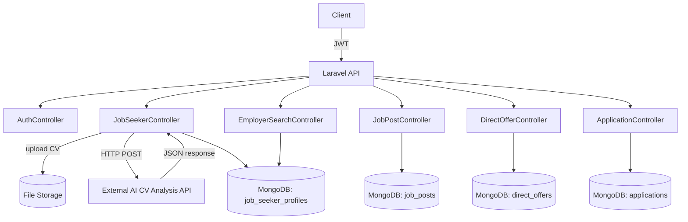

# Design Document: CV AI Job Platform

## Overview

This document describes the technical design for extending the existing Laravel/MongoDB job platform API. The platform connects job seekers and employers through a set of REST API endpoints, with an AI-powered CV analysis pipeline at its core.

The system builds on the existing codebase (User, Employer, JobPost, JobSeekerProfile, Application models; JWT auth; MongoDB via `mongodb/laravel-mongodb`) and adds:

- CV upload with async AI analysis integration
- Employer job post CRUD
- Employer job seeker search (filterable by skills, ATS score, location)
- Direct job offer system (employer → job seeker)
- Application status management by employers

All endpoints are protected by JWT authentication and role-based middleware (`CheckRole`).

---

## Architecture



**Key design decisions:**

- CV analysis is **synchronous** on upload — the API call to the AI service happens within the request lifecycle and the response is returned to the client. This keeps the implementation simple given the existing codebase has no queue worker setup for async jobs.
- All data is stored in **MongoDB** via the existing `mongodb/laravel-mongodb` Eloquent driver.
- Role enforcement uses the existing `CheckRole` middleware with roles `employee`, `employer`, and `admin`.

---

## Components and Interfaces

### CV Upload & Analysis Pipeline

**Endpoint:** `POST /api/job-seeker/resume/upload-and-analyze`

**Flow:**
1. Validate file (PDF/DOC/DOCX, ≤ 10 MB).
2. Store file to `storage/app/public/resumes/`.
3. Delete previous CV file if one exists on the profile.
4. POST the file to the external AI CV Analysis API using Laravel's `Http` facade.
5. Parse the returned JSON `analysis` object.
6. Update the `JobSeekerProfile` with all AI-derived fields plus `cv_file_path`.
7. Return the updated profile.

**CvAnalysisService** (new `app/Services/CvAnalysisService.php`):
```php
interface CvAnalysisServiceInterface {
    public function analyze(string $filePath): array; // returns parsed analysis array or throws
}
```

### Job Post Controller

**New:** `app/Http/Controllers/API/JobPostController.php`

| Method | Endpoint | Description |
|--------|----------|-------------|
| GET | `/api/jobs` | Public: list active job posts (paginated, filterable) |
| GET | `/api/jobs/{id}` | Public: get single job post |
| POST | `/api/employer/jobs` | Employer: create job post |
| PUT | `/api/employer/jobs/{id}` | Employer: update own job post |
| DELETE | `/api/employer/jobs/{id}` | Employer: delete own job post |
| GET | `/api/employer/jobs` | Employer: list own job posts with application counts |

### Employer Search Controller

**New:** `app/Http/Controllers/API/EmployerSearchController.php`

| Method | Endpoint | Description |
|--------|----------|-------------|
| GET | `/api/employer/seekers` | Search job seekers (filterable) |
| GET | `/api/employer/seekers/{userId}` | Get a specific job seeker's public profile |

### Direct Offer Controller

**New:** `app/Http/Controllers/API/DirectOfferController.php`

| Method | Endpoint | Description |
|--------|----------|-------------|
| POST | `/api/employer/offers` | Employer: send direct offer |
| GET | `/api/employer/offers` | Employer: list sent offers |
| GET | `/api/job-seeker/offers` | Job seeker: list received offers |
| POST | `/api/job-seeker/offers/{id}/accept` | Job seeker: accept offer |
| POST | `/api/job-seeker/offers/{id}/decline` | Job seeker: decline offer |

### Application Controller (extended)

**Extended:** `app/Http/Controllers/API/ApplicationController.php`

| Method | Endpoint | Description |
|--------|----------|-------------|
| GET | `/api/employer/jobs/{jobId}/applications` | Employer: list applications for a job post |
| PUT | `/api/employer/applications/{id}/status` | Employer: update application status |

---

## Data Models

### JobSeekerProfile (extended)

Adds AI analysis fields to the existing `job_seeker_profiles` collection:

```php
protected $fillable = [
    // existing fields ...
    'cv_file_path',          // string: path to stored CV file
    'ai_full_name',          // string
    'ai_email',              // string
    'ai_phone',              // string
    'ai_location',           // string
    'ai_summary',            // string
    'ai_skills',             // array of strings
    'ai_work_history',       // array of objects {job_title, company, start_date, end_date}
    'ai_projects',           // array of objects {project_name, technologies[]}
    'ai_overall_evaluation', // string
    'ats_score',             // integer 0-100
    'ai_detected_language',  // string
    'ai_analyzed_at',        // datetime
];
```

AI fields are prefixed with `ai_` to distinguish them from manually entered profile fields. `ats_score` is unprefixed because it is used as a search/filter criterion.

### DirectOffer (new model)

New collection: `direct_offers`

```php
protected $fillable = [
    'employer_id',    // string: User _id of the employer
    'job_seeker_id',  // string: User _id of the job seeker
    'job_post_id',    // string: JobPost _id
    'message',        // string: max 1000 chars
    'status',         // enum: pending | accepted | declined
];

protected $casts = [
    'created_at' => 'datetime',
    'updated_at' => 'datetime',
];
```

**Relationships:**
- `belongsTo(User::class, 'employer_id')`
- `belongsTo(User::class, 'job_seeker_id')`
- `belongsTo(JobPost::class, 'job_post_id')`

### JobPost (extended)

Adds optional salary range fields for filtering:

```php
// salary_range already exists as array cast
// Standardize structure: ['min' => int, 'max' => int, 'currency' => string]
```

---

## Correctness Properties

*A property is a characteristic or behavior that should hold true across all valid executions of a system — essentially, a formal statement about what the system should do. Properties serve as the bridge between human-readable specifications and machine-verifiable correctness guarantees.*


### Property 1: CV upload triggers analysis and stores all AI fields
*For any* valid CV file uploaded by a job seeker, the system should call the AI analysis service, and all fields from the `analysis` object (`full_name`, `email`, `phone`, `location`, `summary`, `skills`, `work_history`, `projects`, `ai_overall_evaluation`, `ats_score`, `detected_language`) should be persisted to the job seeker's profile, and `cv_file_path` should point to the stored file.
**Validates: Requirements 1.1, 1.2, 1.3, 1.7, 2.4**

### Property 2: Failed AI analysis does not overwrite existing profile data
*For any* job seeker profile with existing data, if the AI analysis service returns a non-success response, the profile fields should remain unchanged after the upload attempt.
**Validates: Requirements 1.6**

### Property 3: Re-uploading CV replaces file path
*For any* job seeker who uploads a CV twice, after the second upload the `cv_file_path` should reference the second file, not the first.
**Validates: Requirements 2.5**

### Property 4: Profile partial update only changes provided fields
*For any* job seeker profile and any subset of valid updatable fields, submitting an update with only those fields should change exactly those fields and leave all other fields with their previous values.
**Validates: Requirements 2.2**

### Property 5: Job search returns only active posts
*For any* set of job posts (mix of active and inactive), the job search endpoint should return only posts where `is_active = true`.
**Validates: Requirements 3.1**

### Property 6: Job search filters are applied conjunctively
*For any* combination of search filters (keyword, location, job_type, category, min_salary), all returned job posts must satisfy every provided filter simultaneously.
**Validates: Requirements 3.2, 3.3, 3.4, 3.5, 3.6, 3.7**

### Property 7: Job post fetch by ID returns correct data
*For any* existing job post, fetching it by ID should return a response containing all the fields that were set at creation time.
**Validates: Requirements 3.8**

### Property 8: Application creation produces a pending record
*For any* job seeker and any active job post the seeker has not applied to before, submitting an application should create exactly one Application record with `status = "pending"` and return HTTP 201.
**Validates: Requirements 4.1**

### Property 9: Duplicate application is rejected
*For any* job seeker who has already applied to a job post, submitting a second application to the same post should return HTTP 409 and not create a new Application record.
**Validates: Requirements 4.2**

### Property 10: Resume source selection
*For any* application submission, if no CV file is attached the application's `resume` field should equal the job seeker's `cv_file_path`; if a CV file is attached, the application's `resume` field should reference the newly uploaded file.
**Validates: Requirements 4.4, 4.5**

### Property 11: Application withdrawal removes the record
*For any* job seeker with a pending application, withdrawing it should result in that application no longer appearing in the job seeker's application list.
**Validates: Requirements 4.7**

### Property 12: New job post is active by default
*For any* valid job post creation request by an approved employer, the created Job_Post should have `is_active = true` and be returned with HTTP 201.
**Validates: Requirements 5.1, 5.3**

### Property 13: Job post update persists changes
*For any* employer updating their own job post with valid data, the stored job post should reflect all provided changes after the update.
**Validates: Requirements 5.4**

### Property 14: Deactivated job post is excluded from job seeker search
*For any* job post that has been deactivated by its employer, that post should not appear in any job seeker search results.
**Validates: Requirements 5.6**

### Property 15: Employer job post list includes application counts
*For any* employer with N job posts, requesting their job post list should return exactly N posts, each annotated with the correct count of applications received.
**Validates: Requirements 5.7**

### Property 16: Job post deletion removes the record
*For any* employer deleting their own job post, a subsequent fetch of that post by ID should return HTTP 404.
**Validates: Requirements 5.8**

### Property 17: Employer cannot modify another employer's posts
*For any* employer attempting to update or delete a job post that belongs to a different employer, the system should return HTTP 403 and leave the post unchanged.
**Validates: Requirements 5.5, 5.9**

### Property 18: Seeker search returns only actively seeking profiles
*For any* set of job seeker profiles (mix of actively seeking and not), the employer seeker search endpoint should return only profiles where `is_actively_seeking = true`.
**Validates: Requirements 6.1**

### Property 19: Seeker search filters are applied conjunctively
*For any* combination of seeker search filters (skills, min_ats_score, max_ats_score, location, keyword), all returned profiles must satisfy every provided filter simultaneously.
**Validates: Requirements 6.2, 6.3, 6.4, 6.5, 6.6, 6.7**

### Property 20: Public seeker profile excludes sensitive fields
*For any* job seeker profile, the public profile response returned to an employer must not contain the `password`, `email`, or `phone` fields.
**Validates: Requirements 6.8**

### Property 21: Direct offer creation produces a pending record
*For any* approved employer sending a valid direct offer to a job seeker for their own job post, the system should create a Direct_Offer with `status = "pending"` and return HTTP 201.
**Validates: Requirements 7.1**

### Property 22: Duplicate direct offer is rejected
*For any* employer who has already sent a direct offer for a given job post to a given job seeker, sending the same offer again should return HTTP 409 and not create a new Direct_Offer record.
**Validates: Requirements 7.5**

### Property 23: Offer status transitions are correct
*For any* pending direct offer, accepting it should set `status = "accepted"` and declining it should set `status = "declined"`.
**Validates: Requirements 7.7, 7.8**

### Property 24: Accepting a direct offer creates an application
*For any* job seeker who accepts a direct offer, an Application record with `status = "pending"` linking that job seeker to the offer's job post should be created.
**Validates: Requirements 7.7**

### Property 25: Offer list endpoints return correct scoped data
*For any* employer, their sent offers list should contain only offers they created. *For any* job seeker, their received offers list should contain only offers addressed to them.
**Validates: Requirements 7.6, 7.10**

### Property 26: Employer application list includes enriched data
*For any* employer's job post with applications, the application list endpoint should return each application annotated with the applicant's name and ATS score.
**Validates: Requirements 8.1**

### Property 27: Application status and feedback update is persisted
*For any* application belonging to an employer's job post, updating the status (to `reviewed`, `accepted`, or `rejected`) and optionally providing feedback should result in both the new status and feedback being stored on the Application record.
**Validates: Requirements 8.2, 8.4**

---

## Error Handling

| Scenario | HTTP Status | Response |
|----------|-------------|----------|
| CV file too large or wrong MIME type | 422 | Validation errors array |
| AI service HTTP error / timeout | 502 | `{"message": "CV analysis service unavailable"}` |
| AI service returns non-success status | 422 | `{"message": "CV analysis failed", "reason": "..."}` |
| Resource not found (job post, application, offer) | 404 | `{"message": "...not found"}` |
| Duplicate application or offer | 409 | `{"message": "Already applied / offer already sent"}` |
| Authorization failure (wrong owner) | 403 | `{"message": "Forbidden"}` |
| Validation failure (missing/invalid fields) | 422 | `{"errors": {...}}` |
| Unauthenticated request | 401 | `{"message": "Unauthenticated"}` |
| Wrong role | 403 | `{"message": "Forbidden"}` |

All error responses follow the same JSON envelope. The `CvAnalysisService` wraps the `Http` facade call in a try/catch and throws a typed exception (`CvAnalysisException`) that the controller catches and maps to the appropriate HTTP response.

---

## Testing Strategy

### Dual Testing Approach

Both unit tests and property-based tests are required and complementary:

- **Unit tests** (PHPUnit): verify specific examples, edge cases, error conditions, and integration points.
- **Property-based tests** (using [**Eris**](https://github.com/giorgiosironi/eris) — a PHP property-based testing library for PHPUnit): verify universal properties across many generated inputs.

### Property-Based Testing Configuration

- Library: **Eris** (`giorgiosironi/eris`) — integrates with PHPUnit via `Eris\TestTrait`.
- Each property test must run a minimum of **100 iterations**.
- Each property test must be tagged with a comment referencing the design property:
  ```php
  // Feature: cv-ai-job-platform, Property 1: CV upload triggers analysis and stores all AI fields
  ```
- Each correctness property from this document must be implemented as a **single** property-based test.

### Unit Test Coverage

Unit tests should cover:
- `CvAnalysisService`: mock HTTP responses (success, 502, non-success status)
- `JobSeekerController`: CV upload validation (wrong MIME, oversized file)
- `ApplicationController`: duplicate application, withdraw accepted application
- `DirectOfferController`: wrong owner job post, non-seeker target, duplicate offer
- `JobPostController`: missing required fields, wrong owner update/delete
- `EmployerSearchController`: non-existent seeker profile

### Property Test Coverage

Each of the 27 properties above maps to one property-based test. Key generators needed:
- Random valid CV analysis JSON payloads
- Random job post collections (mix of active/inactive, various fields)
- Random job seeker profiles (mix of actively seeking, various skills/ATS scores)
- Random filter parameter combinations
- Random application and direct offer records
